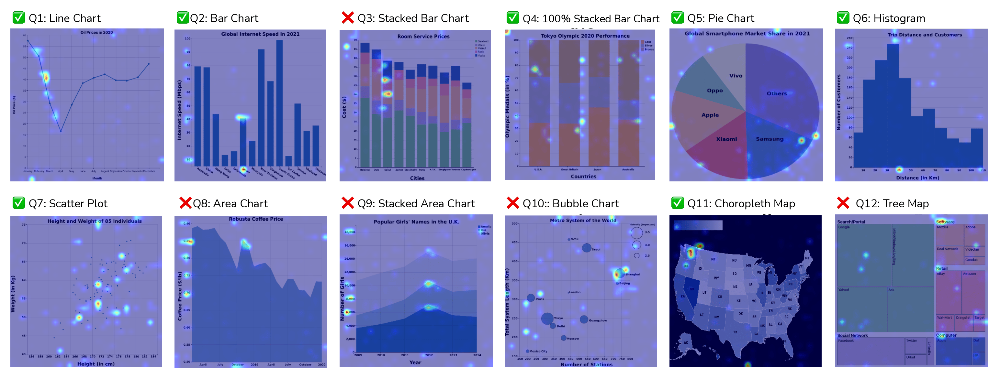

<!-- markdownlint-disable first-line-h1 -->
<!-- markdownlint-disable html -->
<!-- markdownlint-disable no-duplicate-header -->

<div align="center">
    <h1>Probing Vis Literacy of Vision Language Models: the Good, the Bad, and the Ugly</h1>
</div>

<div align="center">
    <a href="https://www.uw-insight-lab.com/" target="_blank">
        
    </a>
    <a href="https://huggingface.co/uw-insight-lab" target="_blank">
        
    </a>
    <a href="https://github.com/AustingDong/Probing-Vis-Literacy-of-Vision-Language-Models/blob/main/LICENSE" target="_blank">
        
    </a>
    <a href="https://github.com/AustingDong/Probing-Vis-Literacy-of-Vision-Language-Models/stargazers" target="_blank">
        
    </a>
</div>

<div align="center">
    
</div>

## 🚀 Quick Start

<details>
<summary><h3>⚙️ Setup your local environment</h3></summary>

### Install Dependencies

```shell
pip install --no-cache-dir --user -e .
pip install --no-cache-dir --user opencv-python
pip install --no-cache-dir --user -r /code/requirements-gradio.txt
```

### Launch the Gradio App

```shell
gradio app.py
```

</details>

<details>
<summary><h3>🐋 Run with Docker (No Setup Required)</h3></summary>

You can also build and run the app in an isolated Docker container:

```shell
docker build -t probing-vis-literacy .
docker run -p 7860:7860 probing-vis-literacy
```

</details>

### 🧭 App Guide

<div align="center">
| Widget | Description |
|--------|-------------|
| `model` | Select the Vision-Language Model (VLM) to evaluate: `ChartGemma`, `Janus-Pro-1B`, `Janus-Pro-7B`, `LLaVA-1.5-7B`. |
| `test` | Choose the type of visual literacy test to perform. |
| `seed` | Set the random seed for reproducibility. |
| `top_p` | Nucleus sampling parameter that limits sampling to the most probable tokens with cumulative probability `p`. |
| `temperature` | Sampling temperature to control randomness in output generation. |
| `target_token_idx` | Index of the token in the question to be evaluated (used for visualization). |
| `response_type` | Output format: `visualization only` or `answer + visualization`. |
| `focus` | Determines which part of the response is visualized: `question` only or `question + answer`. |
| `visualization type` | Currently supports `AG-CAM`; may support more methods in future extensions. |
| `layers accumulate method` | Method to combine attention across layers: `add` or `multiply`. |
| `activation function` | Activation function used in attention visualization: `softmax` or `sigmoid`. |
| `visualization layers min/max` | Set the range (min/max) of transformer layers used for visualization. |
</div>
