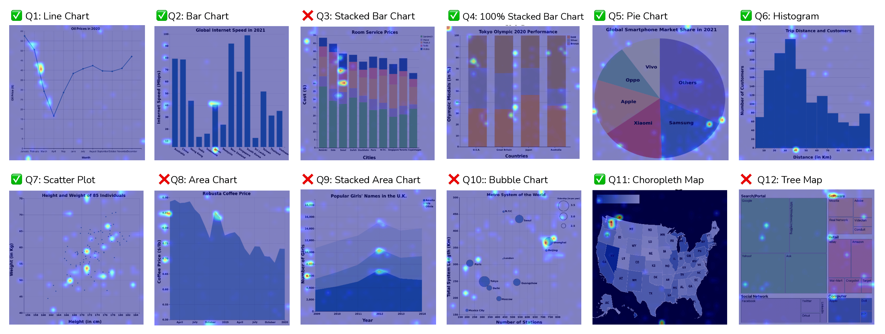

<!-- markdownlint-disable first-line-h1 -->
<!-- markdownlint-disable html -->
<!-- markdownlint-disable no-duplicate-header -->

<div align="center">
    <h1>Probing Vis Literacy of Vision Language Models: the Good, the Bad, and the Ugly</h1>
</div>

<div align="center">
    <a href="https://arxiv.org/abs/2504.05445">
        
    </a>
    <a href="https://www.uw-insight-lab.com/">
        
    </a>
    <a href="https://huggingface.co/spaces/uw-insight-lab/Probing-Vis-Literacy-of-VLMs">
        
    </a>
    <a href="LICENSE">
        
    </a>
    <a href="https://github.com/AustingDong/Probing-Vis-Literacy-of-VLMs/stargazers">
        
    </a>
</div>

<div align="center">
    
</div>

## 🚀 Quick Start

<details>
<summary><h3>⚙️ Set up your local environment</h3></summary>

Python 3.10 to 3.12 is supported.

### Install dependencies

```shell
python -m pip install --no-cache-dir --user -e ".[gradio]"
```

### Launch the Gradio app

```shell
python app.py
```

Open <http://localhost:7860>.

</details>

<details>
<summary><h3>🐳 Run with Docker (NVIDIA or AMD)</h3></summary>

NVIDIA CUDA and AMD ROCm use separate, pinned images and Compose entry points.
Both execute a real GPU kernel before Gradio starts and exit early when the
selected accelerator is unavailable or the image does not match the GPU.

### NVIDIA

The NVIDIA image uses PyTorch 2.9.1 with CUDA 13.0 for Blackwell/RTX 50-series
compatibility. It requires a compatible NVIDIA driver and NVIDIA GPU access in
Docker. Docker Desktop must use its WSL2 backend on Windows.

```shell
docker compose -f compose.nvidia.yaml build
docker compose -f compose.nvidia.yaml up
```

Validate NVIDIA passthrough independently:

```shell
docker run --rm --gpus all nvidia/cuda:13.0.0-base-ubuntu22.04 nvidia-smi
```

### AMD

The AMD image uses AMD's PyTorch 2.9.1 / ROCm 7.2.4 image with `gfx950`
support for Instinct MI350/MI355 accelerators. It requires a supported Linux
x86-64 host with the AMD kernel driver; Windows Docker Desktop is not a
supported ROCm host.

```shell
docker compose -f compose.amd.yaml build
docker compose -f compose.amd.yaml up
```

Validate AMD passthrough independently:

```shell
docker run --rm \
  --device=/dev/kfd \
  --device=/dev/dri \
  --group-add video \
  --security-opt seccomp=unconfined \
  rocm/pytorch:rocm7.2.4_ubuntu24.04_py3.12_pytorch_release_2.9.1 \
  python -c "import torch; print(torch.cuda.is_available(), torch.version.hip, torch.cuda.get_device_name(0))"
```

Open <http://localhost:7860> after either stack starts. Model downloads and
results use named volumes; the Hugging Face cache and results are shared
between the two entry points, while the PyTorch cache is backend-specific.

</details>

## 🧭 App Guide

<div align="center">

| Widget | Description |
|--------|-------------|
| `model` | Select the Vision-Language Model (VLM) to evaluate: `ChartGemma-3B`, `Janus-Pro-1B`, `Janus-Pro-7B`, or `LLaVA-1.5-7B`. |
| `test` | Choose `mini-VLAT`, `VLAT`, `VLAT-old`, or `New_test`. |
| `Chart Type` | Optionally limit the selected test to a chart type; use `Any` for no filter. |
| `seed` | Set the random seed for reproducibility. |
| `top_p` | Nucleus sampling parameter that limits sampling to the most probable tokens with cumulative probability `p`. |
| `temperature` | Sampling temperature to control randomness in output generation. |
| `target_token_idx` | Index of the token in the question to be evaluated (used for visualization). |
| `response_type` | Output format: `Visualization only` or `answer + visualization`. |
| `focus` | Determines which part of the response is visualized: `question` only or `question + answer`. |
| `visualization type` | Currently supports `AG-CAM`, and may support more methods in future extensions. |
| `layers accumulate method` | Method to combine attention across layers: `sum` or `mult`. |
| `activation function` | Activation function used in attention visualization: `softmax` or `sigmoid`. |
| `visualization layers min/max` | Set the range (min/max) of transformer layers used for visualization. |

</div>

## 📚 Citation

```bibtex
@misc{dong2025probingvisualizationliteracyvision,
      title={Probing the Visualization Literacy of Vision Language Models: the Good, the Bad, and the Ugly},
      author={Lianghan Dong and Anamaria Crisan},
      year={2025},
      eprint={2504.05445},
      archivePrefix={arXiv},
      primaryClass={cs.HC},
      url={https://arxiv.org/abs/2504.05445},
}
```

## 🙏 Acknowledgements

This project is built upon and inspired by the
[Janus](https://github.com/deepseek-ai/Janus) repository. We sincerely thank
the original authors for their excellent work and open-source contributions.

We are also grateful to the members of the UW Insight Lab — F. Feng, X. Yu,
and V. Bector — for their valuable feedback. Special thanks to F. Shi for
insightful discussions and suggestions.

L. Dong is supported by the Cheriton School of Computer Science Undergraduate
Research Fellowship.
